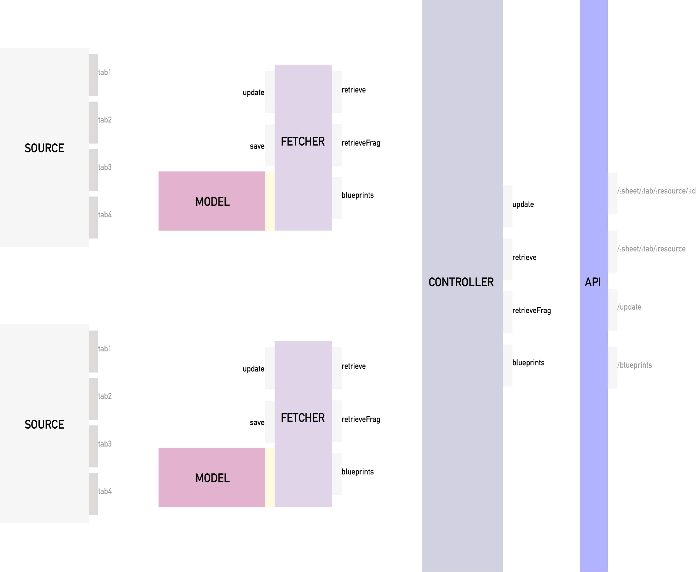

# Architecture

Datasheet Server uses the architecture diagrammed above to allow effective
management of the sheets it represents.

It exposes an API with four endpoints:
 * `/:sheet/:tab/:resource` - the primary means of accessing data in the
     server. The name of a sheet is specified in
     [_config.js](https://github.com/forensic-architecture/datasheet-server/blob/develop/src/config.js#L7).
     Each tab on the sheet is in lower case, with spaces replaced by
     underscores. The resource name is the same as the name of the blueprinter
     specified for the tab is config.js.
 * `/:sheet/:tab/:resource/:id` - when the resource is a list, items in the list
     can be accessed individually as well.
 * `/update` - when this route is queried with a GET request, each of the
     fetchers in the server will update their models from the relevant sheet.
 * `/blueprints` - a JSON object that represents all available sheets, tabs, and
     resources in the server.

# Controller
The [controller](https://github.com/forensic-architecture/datasheet-server/blob/develop/src/lib/Controller.js)
manages all of the fetchers in the server. Its `update` triggers the update
mechanisms of all the `update`s in the fetchers it manages. Its `retrieve` and
`retrieveFrag` methods find the appropriate fetcher, and trigger its 
respectively named method. Its `bluerprints` method collects the blueprints
from all fetchers, and presents them as a single list.

# Fetcher
The [fetcher](https://github.com/forensic-architecture/datasheet-server/blob/develop/src/lib/Fetcher.js)
is the most complex component in datasheet server. Its responsiblity is to
interface with a sheet, and store the data from that sheet in a model. It also
makes information from that model available to the controller.

# Model
The model layer is an [interface](https://github.com/forensic-architecture/datasheet-server/blob/develop/src/models/Interface.js)
that specifies how stored data must be made available to a fetcher. The
implementation of the model layer ([StoreJson](https://github.com/forensic-architecture/datasheet-server/blob/develop/src/models/StoreJson.js)
is one example) determines the time and space complexity of retrieval.

